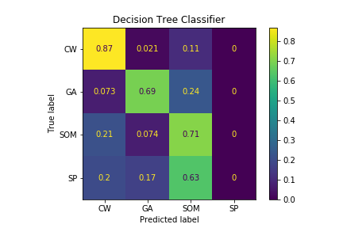

```{r eval=TRUE, include = FALSE, echo=FALSE}
library(tidyverse)
library(reshape2)
cvrp <- read.csv(file="Data/CVRP_dataset.csv")
```

# Introduction

This project explored how well the Decision Tree Algorithm can predict the best heuristic for a Capacitated Vehicle Routing Problem (CVRP) instance and supported my ongoing research in the Mechanical, Systems, and Industrial Engineering (MCISE) Department.  The CVRP is defined as a problem where a fleet of homogenous vehicles is directed to service a set of cities from a single depot.  The depot has zero demand and unlimited capacity, and each city has a positive and non-zero demand.  The cities must all be serviced, and vehicle capacity cannot be violated.  All problems exist in the 2-D Euclidean plane, and the objective is to minimize the total fleet distance travelled.  In application, this problem is used to formulate routes for delivery vehicles across many industries.  
  
Despite its simple definition, the CVRP is NP-Hard, meaning no polynomial time algorithm exists for exactly solving all problems to optimality.  Global research has produced heuristic algorithms that provide good solutions within a reasonable run time, albetit a new algorithm’s improvements can often be isolated to certain instance types [@re:wolpert:macready; @re:kothoffa; @re:steinhaus].
  
The Decision Tree (DT) can be used for CVRP algorithm prediction by formulating the problem as a machine learning classification task.  CVRP instances must be vectorized into relevant features and labeled by the heuristic which produced the best solution (i.e. minimum fleet distance travelled).  This study used a set of 23 CVRP features found in the literature, which largely characterize instances by their size, spatial attributes, and vehicle requirements.  Examples include the number of cities, minimum fleet size, standard deviation of demands, and average route length.  For the purposes of this report, the features are listed by number with a logical short title.  This study considered four solution heuristics to compete for the instance label: 

1. The Clarke & Wright Savings Algorithm (CW),

2. The Sweep Algorithm (SP),

3. An accelerated Genetic Algorithm (GA),

4. The Self-Organizing Map (SOM).

I generated a novel library of 4,897 CVRP instances through earlier work in MCISE.  I created the dataset used in this project by first extracting the 23 instance features and then mapping labels by solving all instances with all algorithms.  The dataset is in csv format and is of dimension 4,897 rows by 32 columns.  Each row constitutes a CVRP instance represented by its features and labeled by its best algorithm, along with other administrative information such as which city, depot, and demand functions were used in the instance generation algorithm.  

This project focused on exploring the data set and performing the classification task with the DT algorithm.  The goals of this project are as follows:

1.  Examine the feature distributions to consider the diversity of their values.  

2.  Present the algorithm label counts to gain summary insight to the algorithm performances.

3.  Explore feature-to-label relationships for insight to the range of feature values where algorithms perform best.

4.  Report the prediction accuracy of the optimal DT model and compare it to a metric found in the literature.  

# Methods and Results
## Feature Distributions
This section presents the distributions of all 23 features, which are wrapped into figures each containing four features.  Examining the diversity of feature values is a subjective, yet intuitive, way to estimate how valuable a feature can be to the DT algorithm.  By inspection, a feature's diversity may be evaluated by considering the range of its values along the X variable.  This stems from the concept that features with the most variation contain the most information about the dataset.  The features are short titled and employ free axes to avoid distortion.  

```{r fig.width=5, fig.height=4, fig.align='center', message=FALSE, eval=TRUE, echo=FALSE}
################### Create Histogram of all Features in the CVRP dataset ################

# Features 1 - 4
d <- melt(cvrp[c(7:10)])
ggplot(data = d, mapping = aes(x = value)) + 
  facet_wrap(~variable, scales = 'free') +
  geom_histogram() + 
  labs(x = 'Feature Value', y = 'Count') + #, title = 'Histograms of Features 1 - 4') +
  theme_classic()+
  theme(plot.title = element_text(hjust = 0.5))

```

The feature 1.NumberCities shows the most diversity in its values out of this set.  The other three features, especially 3.XCent and 4.YCent are much more limited.

```{r fig.width=5, fig.height=4, fig.align='center', message=FALSE, eval=TRUE, echo=FALSE}
# Features 5 - 8
d <- melt(cvrp[c(11:14)])
ggplot(data = d, mapping = aes(x = value)) + 
  facet_wrap(~variable, scales = 'free') +
  geom_histogram() + 
  labs(x = 'Feature Value', y = 'Count') + #, title = 'Histograms of Features 5 - 8') +
  theme_classic()+
  theme(plot.title = element_text(hjust = 0.5))

```
The second set of plots exhibit greater diversity across the features. Of note is feature 6.FracDistinctDist, which has an apparently abnormal amount of lower end values. The values of this feature are explained by the methods used to position cities in the instance generation algorithm.  One of these methods is designed to position cities at equidistant, or nearly equidistant, locations from one another (the module is referred to as 'Equidistant'). This minimizes the fraction of distinct values in the instance's distance matrix, which is represented by feature 6.  The lower end values of this feature likely come from the 'Equidistant' positioning module, since the feature contains
`r df = data.frame(table(cvrp$X6.FracDistinctDist)); sum(df$Freq[1:11])`
lower end values and the 'Equidistant' method is also used exactly 
`r df = data.frame(table(cvrp$CtyModule)); df$Freq[which(df$Var1=='E')]`
times. 

The features 7.SD_NNDist and 8.CV_NNDist also have an unusual amount of lower end values.  These features, which represent the standard deviation of the instance's nearest neighbor distance and the coefficient of variation of the instance's nearest neighbor distance are correlated to 6.FracDistinctDist.  This can be shown through a Pearson correlation matrix of these features:
```{r eval=TRUE, echo=FALSE}
df.cor = cor(cvrp[12:14])
df.cor
```

```{r fig.width=5, fig.height=4, fig.align='center', message=FALSE, eval=TRUE, echo=FALSE}
# Features 9 - 12
d <- melt(cvrp[c(15:18)])
ggplot(data = d, mapping = aes(x = value)) + 
  facet_wrap(~variable, scales = 'free') +
  geom_histogram() + 
  labs(x = 'Feature Value', y = 'Count') + #, title = 'Histograms of Features 9 - 12') +
  theme_classic()+
  theme(plot.title = element_text(hjust = 0.5))

```

The next batch of plots further support diversity of feature values. These features all derive from an automated city clustering technique using the DBSCAN algorithm.  Of interest is the apparently high value of
`r df = data.frame(table(cvrp$X12.NumberClusters)); df$Var1[which.max(df$Freq)]`
clusters in 12.NumberClusters.  Since the number of clusters in an instance is principally related to the spatial location of the cities, examining the city positioning methods that result in exactly 5 clusters can be insightful.  


```{r eval=TRUE, include = FALSE, echo=FALSE}
df = cvrp %>%
  group_by(CtyModule) %>%
  filter(X12.NumberClusters == 5) %>%
  summarise(Count_5Clust = sum(X12.NumberClusters)/5)
```
Indeed, further analysis revealed that the 'Equidistant' city positioning module made up for 
`r round(max(df$Count_5Clust)/sum(df$Count_5Clust), 3) * 100` %
of all instances containing 5 clusters.  The generation algorithm contained four different methods to position cities, so the fact this single module resulted in 5 clusters with such frequency is a notable find worthy of further investigation into the clustering methods of DBSCAN.  

```{r fig.width=5, fig.height=4, fig.align='center', message=FALSE, eval=TRUE, echo=FALSE}
# Features 13 - 16
d <- melt(cvrp[c(19:22)])
ggplot(data = d, mapping = aes(x = value)) + 
  facet_wrap(~variable, scales = 'free') +
  geom_histogram() + 
  labs(x = 'Feature Value', y = 'Count') + #, title = 'Histograms of Features 13 - 16') +
  theme_classic()+
  theme(plot.title = element_text(hjust = 0.5))

```
The subsequent set of plots displayed in figure 16 continue to reflect diversity in the problem space. The distributions of 14.XDepot and 15.YDepot, which correspond to the coordinate (X,Y) of the depot assignment, reveal the positioning methods for the depot. It is readily apparent the depot is either positioned at the origin (0,0), the center (250,250), or some random point.

```{r fig.width=5, fig.height=4, fig.align='center', message=FALSE, eval=TRUE, echo=FALSE}
# Features 17 - 20
d <- melt(cvrp[c(23:26)])
ggplot(data = d, mapping = aes(x = value)) + 
  facet_wrap(~variable, scales = 'free') +
  geom_histogram() + 
  labs(x = 'Feature Value', y = 'Count') + #, title = 'Histograms of Features 17 - 20') +
  theme_classic()+
  theme(plot.title = element_text(hjust = 0.5))

```
Of interest in this set of plots is 19.Ratio OutlierdemDem, which displays a high count where the ratio of outlier city demand to total city demand is equal to 0. This is only feasible if the outlier demand is 0; therefore, it can only be possible if the instance has no outlier cities since all cities have a positive non zero demand.

For an instance to have no outliers, all of its cities must be assigned within a cluster.  As discussed earlier, the creation method that ultimately leads to clustering results is the city positioning module.  Therefore, by examining the city positioning methods which result in a value of 0 in 19.Ratio_OutlierdemDem we may see if there is a pattern between how cities are positioned and if they allow for outliers in the clustering methodology.  
```{r eval=TRUE, include = FALSE, echo=FALSE}
df = cvrp %>%
  filter(X19.Ratio_OutlierdemDem == 0) %>%
  count(CtyModule)

df$CtyModule[which.max(df$n)]
max(df$n)/sum(df$n)
```
This analysis revealed an interesting pattern as the 'Equidistant' city module accounted for 
`r round(max(df$n)/sum(df$n), 3) * 100`%
of all instances containing with no outlier demand.  Upon reviewing the literature further, this behavior is consistent with the DBSCAN documentation [@re:scikit-learn]. DBSCAN is a hierarchical clustering algorithm that produces no outliers on data spread uniformly throughout a problem area. 
```{r eval=TRUE, include = FALSE, echo=FALSE}
df = cvrp %>%
  filter(CtyModule == 'E') %>%
  count(X12.NumberClusters)
```
This is also related to an earlier observation regarding the 'Equidistant' module's high count of instances containing 5 clusters.  In fact, all instances constructed under this city position module contain either `r df$X12.NumberClusters[1]` or `r df$X12.NumberClusters[2]` clusters, with `r df$X12.NumberClusters[2]` clusters occurring `r round(df$n[2]/sum(df$n), 3)*100`% of the time. 

```{r fig.width=5, fig.height=4, fig.align='center', message=FALSE, eval=TRUE, echo=FALSE}
# Features 21 - 23
d <- melt(cvrp[c(27:29)])
ggplot(data = d, mapping = aes(x = value)) + 
  facet_wrap(~variable, scales = 'free', nrow = 2) +
  geom_histogram() + 
  labs(x = 'Feature Value', y = 'Count') + #, title = 'Histograms of Features 21 - 23') +
  theme_classic()+
  theme(plot.title = element_text(hjust = 0.5))
```
This last batch of plots also showcase diversity in these features in the data set, particularly 21.AvgRouteLength and 23.MinNumberTrucks.  Though not exact, the 21.AvgRouteLength feature resembles a T[3,6,25] distribution, which was the sampling distribution used in the instance generation algorithm.


## Label Distribution
This section explores the distribution of labels in the dataset and considers how it may influence the selection model.  
```{r fig.width=5, fig.height=4, fig.align='center', eval=TRUE, echo=FALSE}
############ Create Descending Histogram of 'Label' in CVRP dataset######################

# summary table of labels
counts = cvrp %>%
  group_by(Label) %>%
  summarize(counts = length(Label))


# get Label in descending order based upon its count value
counts$Label = factor(counts$Label,                                   
                      levels = counts$Label[order(counts$counts, decreasing = TRUE)])
  
# create Histogram
ggplot(data = counts, mapping = aes(x = Label, y = counts, fill = Label)) + 
  geom_bar(stat = 'identity')+
  labs(x = 'Label', y = 'Count', title = 'Algorithm Labels in CVRP Data Set')+
  geom_text(aes(label = counts), vjust = 1.5, color = 'white', fontface = 'bold', size=3)+
  theme_classic() + 
  theme(plot.title = element_text(size=12))+
  theme(legend.position = 'none')
```

Since the CW and SOM earned significantly more labels than the GA and SP, the DT algorithm will be provided a greater number of training examples for these two heuristics.  This bias may allow for
simpler prediction of their labels in the test data, though is not guaranteed [@re:domingos]. 

For evaluating the effectiveness of an algorithm selection model, one may compare it to a simulated model which universally predicts the most frequently occurring label in the dataset to all test instances. This is called the Single-Best-Solver model, and, in this study, would yield an accuracy of 
`r df = data.frame(table(cvrp$Label)); round(max(df$Freq)/sum(df$Freq), 3)*100`%
by using the 
`r df$Var1[which.max(df$Freq)]`
algorithm.  This comparison metric is discussed later to evaluate the model created by the DT algorithm. 

## Feature-to-Label Analysis
This section explores the distribution of features by their algorithm label. Presented as Box-and-Whisker plots, these visualizations quickly indicate the range of feature values where algorithms performed best. These plots are relevant for intuition on the data set provided to the DT algorithm, which learns from previous feature-to-label relationships to predict the labels of new instances from its feature values.  

The plots are first presented for all 23 features and then commented upon after observing any patterns or indications of algorithm performance within the data.  

```{r fig.width=14, fig.height=18, fig.align='center', message=FALSE, eval=TRUE, echo=FALSE, warning=FALSE}

#list of vectors for feature columns to make
features_list = list(c(7:18),c(19:29))#c(7:18), c(11:14), c(15:18), c(19:22), c(23:26), c(27:29))
box_plots = list()

for (features in features_list) {

  # put cvrp data into long format for ggplot
  cvrp_long = melt(data = cvrp, id.vars = c(features, 34), measure.vars = features,
                   variable.name = 'Feature', value.name = 'Value')

  # put Label in same order as the bar chart
  cvrp_long$Label = factor(cvrp_long$Label,
                        levels = c('CW', 'SOM', 'GA', 'SP'))

    # generate/print the plots for
  print(
    ggplot(data = cvrp_long, mapping = aes(x = Label, y = Value, color = Label)) +
    facet_wrap(~Feature, scales = 'free', nrow = 5, ncol = 3) +
    geom_boxplot() +
    labs(x = 'Algorithm Label', y = 'Feature Value') + #, title = 'Histograms of Features 21 - 23') +
    theme_classic()+
    theme(axis.title = element_text(size = 18), strip.text = element_text(size=16),
          axis.text.x = element_text(size = 14), legend.position = 'none')
    )
  }

```

The feature 1.NumberCities presents an interesting result. The median value for the GA does not intersect with the box of any other algorithm, indicating it may be grouped differently from the others. By observation, it appears the GA performed best on instances containing lower city counts.

In both 6.FracDistinctDist and 7.SD NNDist the GA appears in its own group. As presented earlier, these two features have a strong correlation. When an instance's fraction of distinct distances
in its distance matrix are minimal, and so is the standard deviation of its nearest neighbor distance.  We also know from earlier analyses that low values in these features are attributed to cities being positioned under the 'Equidistant' city module.  Consequently, it is likely the GA performed poorly solving instances created under the 'Equidistant' module.  

The features 21.AvgRouteLength and 23.MinNumberTrucks also reveal noteworthy algorithm behavior.  Two groups possibly exist in 21.AvgRouteLength, one containing CW and GA and another with SOM and SP. This suggests one group performed better with more cities per route and another with less. Since the GA and SOM are both metaheuristics, perhaps increasing their search space in future studies would first lead to domination of its group. In 23.MinNumberTrucks notice the CW in a clear group of its own, outperforming all other algorithms when the instance requires a higher number of trucks. Indeed, with the exception of one GA outlier, the CW performed best on all instances requiring more than approximately 25 routes. 

## Decision Tree Model
Using the python3 script **DSP539_DT**, I was able to explore different parameter settings for the DT algorithm using 10-fold cross validation.  Once the best parameters were found, I trained an optimal model using all training data.  The classification accuracy for the DT model is 
`r acc = read.csv("Results/TestAcc_DataSize.csv", header = TRUE); round(acc$Test.Accuracy,3)*100`%.

The confusion matrix for a classification model presents the probability of correct and incorrect predictions for each label in the test set, and is presented below. 

{width=60%}

The SP algorithm is never predicted as the best performing algorithm, which could be expected due to its infrequency of occurrence. Note that 63% of the true SP labels were predicted as SOM.Researching their performance similarities may be insightful in the future.  The CW algorithm is correctly predicted 87% of the time, though is misclassified as GA or SOM with 2% and 11% probability, respectively.   

# Conclusion
Overall, the DT accuracy of 
`r acc = read.csv("Results/TestAcc_DataSize.csv", header = TRUE); round(acc$Test.Accuracy,3)*100`% 
well outperforms the simulated SBS model that would produce 
`r df = data.frame(table(cvrp$Label)); round(max(df$Freq)/sum(df$Freq), 3)*100`%
with universal application of the CW algorithm.  This positively suggests the model learned from the data before making a prediction, which also verifies the features chosen to represent the instances.  Now I am going to build off this project by exploring different combinations of features and different classification methods, seeing if I can improve upon the classification results.  

# Bibliography
